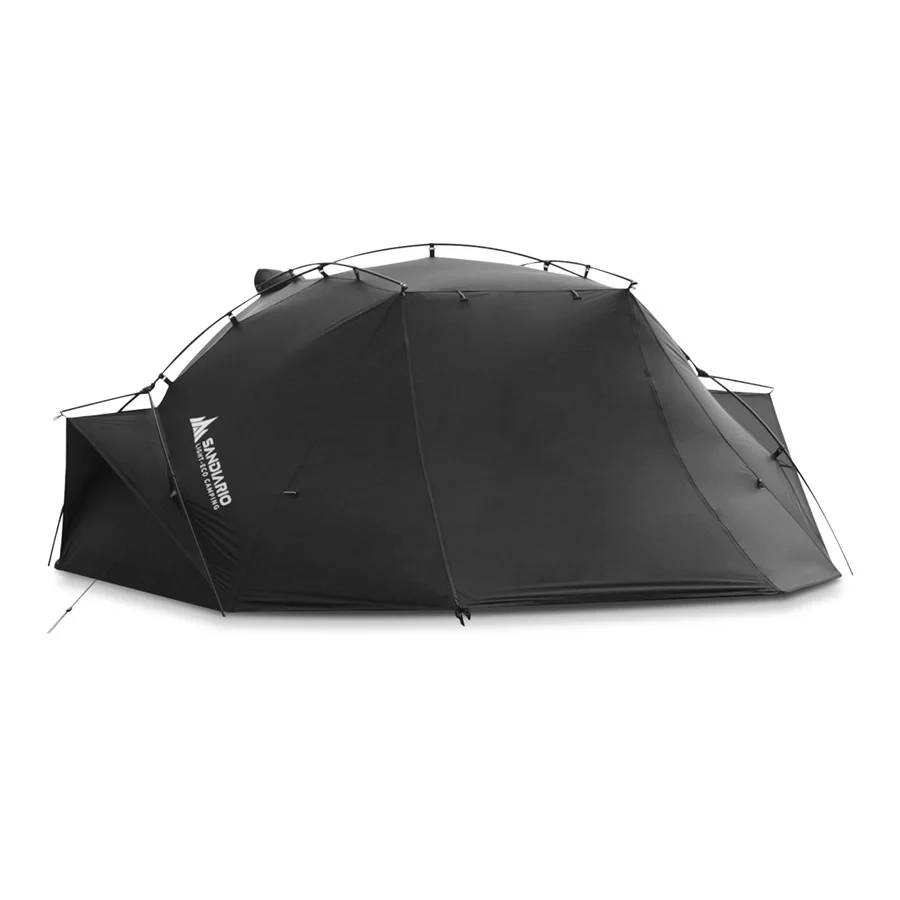

# SANDIARIO MH2P: una carpa para el bosque

Vivir en medio del bosque significa estar preparado para cambios de clima que pueden llegar prácticamente de un momento a otro. Neblina, lluvia, frío y viento son cosas bastante comunes por aquí.

Por eso tenía ganas de probar una carpa que pudiera utilizar precisamente en este tipo de condiciones.

Después de pasar una noche en ella, algo que me quedó bastante claro es que la **SANDIARIO MH2P** se siente como una carpa hecha para soportar este tipo de entorno.

## Lo que más me sorprendió

Una de las primeras cosas que noté fue la **resistencia de los materiales**.

Desde que comencé a armarla me llamó la atención la sensación de las varillas flexibles. Durante el montaje tienes que doblarlas bastante para darle forma a la estructura y, aun así, se sienten firmes y resistentes.

Eso fue algo que me dio bastante confianza desde el principio.

Pero otra cosa que realmente me gustó después de pasar la noche dentro fue lo **cálida que resulta**.

Aquí en el bosque las noches pueden ser bastante frías, especialmente cuando hay lluvia, neblina y viento. Una vez dentro de la carpa se conserva bastante bien el calor y durante mi prueba el frío no terminó siendo un problema.

## Una carpa para diferentes condiciones

La SANDIARIO MH2P me gustó principalmente por:

* **Materiales que se sienten resistentes**
* **Varillas flexibles y firmes**
* **Buen aislamiento durante la noche**
* **Protección contra la lluvia**
* **Buena respuesta ante el viento**
* **Espacio para 2 personas**

No buscaba solamente una carpa para salir de camping ocasionalmente.

Quería algo que pudiera tener aquí y utilizar cuando quisiera pasar una noche afuera, recorrer el terreno o simplemente disfrutar del bosque de una manera diferente.

Y para eso me parece una muy buena opción.

## Una noche frente a la cabaña

Para esta prueba decidí montar la carpa en el patio, justo frente a mi cabaña y rodeado por el bosque.

La idea era pasar una noche completa dentro y ver cómo se comportaba en las condiciones que normalmente tengo por aquí.

Esa noche había bastante humedad, neblina y el viento comenzó a aumentar considerablemente. Esto terminó siendo una buena oportunidad para comprobar qué tan cómoda y protegida se siente la carpa cuando el clima comienza a ponerse complicado.

A pesar de estar a pocos metros de la cabaña, pasar la noche dentro fue una experiencia completamente diferente y me permitió probarla en un entorno real, con el frío, la humedad y el viento propios del bosque.

Eso terminó convirtiéndose en una buena oportunidad para probar la carpa en condiciones mucho más cercanas al uso que realmente le daría.

Mientras pasaba la noche dentro también pensé en lo mucho que me habría gustado tener una carpa así cuando comencé mi proyecto aquí.

Cuando todavía no existía la cabaña, tener un lugar protegido, cálido y relativamente fácil de montar habría hecho muchas cosas bastante más sencillas.

## ¿Vale la pena?

Después de utilizarla y pasar una noche dentro, creo que la **SANDIARIO MH2P** es una buena opción para alguien que busca una carpa resistente y cómoda para salir al bosque.

En mi caso, lo que más valoro es la sensación de resistencia de sus materiales, especialmente las varillas, además de lo cálida que resulta durante la noche. Pero con ventilacion por si hace calor.

También me parece importante que pueda enfrentarse a condiciones que aquí son bastante comunes, como **lluvia, humedad y viento**.

Definitivamente es una carpa que volvería a utilizar para pasar una noche en el bosque.

Aquí puedes verla en acción:

<iframe src="https://www.youtube.com/embed/W7sTjessbD0"
title="Probando la carpa SANDIARIO MH2P"
style="position:absolute;top:0;left:0;width:100%;height:100%;border:0;"
allowfullscreen></iframe>

## ¿Dónde conseguirla?

Puedes consultar la **SANDIARIO MH2P** en Mercado Libre México:

https://www.mercadolibre.com.mx/sandiario-carpa-de-2-personas-de-estructura-cruzada-negro/p/MLM64708911

Para mí es una carpa que tiene mucho sentido para el lugar donde vivo: **resistente, cálida y preparada para enfrentarse a la lluvia y al viento del bosque.**
