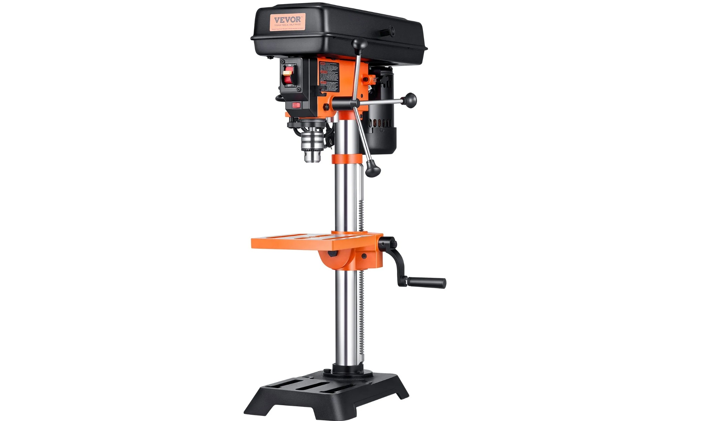

# VEVOR Taladro de Mesa: una herramienta esencial para mis proyectos en el bosque

Cuando se trabaja en proyectos de fabricación y reparación en una cabaña rodeada de bosque, contar con las herramientas adecuadas hace una enorme diferencia. Muchas veces necesito realizar perforaciones precisas en metal, madera u otros materiales, y hacerlo con un taladro convencional puede resultar complicado cuando se busca precisión y repetibilidad.

Por eso, el **taladro de mesa de VEVOR** se convirtió en una herramienta muy útil dentro de mi taller y me ha ayudado en distintos proyectos que estoy realizando aquí en el bosque.

## Una herramienta para trabajar con mayor precisión

Una de las principales ventajas de un taladro de mesa es precisamente la estabilidad que ofrece frente a un taladro manual. Al tener la herramienta fija sobre la mesa, es mucho más sencillo mantener la broca alineada y realizar perforaciones uniformes.

Para mis proyectos esto resulta especialmente práctico. Aquí en el bosque constantemente estoy construyendo, modificando o reparando cosas, desde estructuras y piezas metálicas hasta diferentes componentes para mis proyectos de electrónica y mecánica.

Tener una herramienta dedicada para realizar perforaciones hace que muchos de estos trabajos sean considerablemente más sencillos.

## Ideal para proyectos DIY

Una de las cosas que más me gusta de este tipo de herramientas es que no necesitan estar destinadas únicamente a un taller profesional.

En un proyecto como el mío, donde constantemente estoy construyendo cosas por mi cuenta, un taladro de mesa puede utilizarse para fabricar soportes, preparar piezas metálicas, realizar perforaciones en madera, construir estructuras y muchas otras tareas.

Además, cuando estás trabajando en un lugar alejado de la ciudad, tener tus propias herramientas significa no depender constantemente de llevar cada pieza a un taller.

## Una buena adquisición para mi taller

Después de utilizarlo en mis proyectos, considero que este taladro de mesa es una herramienta que tiene mucho sentido para quienes disfrutan construir y reparar sus propias cosas.

No se trata solamente de tener otra herramienta en el taller. La ventaja está en poder disponer de una máquina que permite trabajar de una manera mucho más controlada cuando una perforación precisa es importante.

Para alguien que está comenzando a equipar un taller, o para quienes ya tienen diferentes proyectos DIY en marcha, considero que puede ser una buena adquisición.

## VEVOR y mis proyectos en el bosque

Gran parte de los proyectos que realizo aquí están relacionados con electrónica, automatización, energía, fabricación y vida autosustentable. Muchas veces estas áreas terminan mezclándose y una herramienta aparentemente sencilla termina siendo muy útil para construir algo mucho más grande.

El taladro de mesa de VEVOR me ha ayudado precisamente en ese tipo de trabajos.

En el siguiente video puedes ver un poco de su desempeño y cómo lo estoy utilizando dentro de mis proyectos:

<iframe src="https://www.youtube.com/embed/K7Vn26n5x7Y"
title="Probando el taladro de mesa VEVOR"
style="position:absolute;top:0;left:0;width:100%;height:100%;border:0;"
allowfullscreen></iframe>

## ¿Dónde comprarlo?

Si estás interesado en adquirir este taladro de mesa o conocer más sobre los productos de VEVOR, puedes utilizar los siguientes enlaces de acuerdo con tu país:

* 🇲🇽 **México:** https://s.vevor.com/QT0P70
* 🇺🇸 **Estados Unidos:** https://s.vevor.com/QT0TOR
* 🇪🇸 **España:** https://s.vevor.com/QT0TO4

Además, VEVOR ofrece un **5% de descuento** utilizando el código:

**VVALL05**

Si estás construyendo tu propio taller, realizando proyectos DIY o simplemente quieres contar con mejores herramientas para trabajar por tu cuenta, vale la pena echarle un vistazo a lo que ofrece VEVOR.

En mi caso, tener este tipo de herramientas aquí en el bosque me permite seguir construyendo y experimentando sin tener que depender constantemente de un taller externo.
