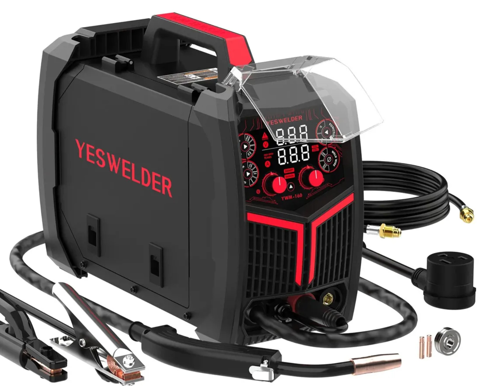

# YESWELDER YWM-160: soldar con energía solar

Vivir en medio del bosque significa que muchas veces tengo que construir, reparar o modificar mis propias cosas. Por eso una soldadora es una herramienta bastante importante en mi taller.

El problema es que aquí la electricidad no viene de la red. Toda la energía sale de mis paneles solares y baterías, así que el consumo de cada herramienta importa.

Por eso me impresiono la **YESWELDER YWM-160**, una inverter de 160 A que permite trabajar con **MIG, TIG y MMA**, además de contar con control sinérgico y pantalla LED.

## Lo que más me sorprendió

Lo que más me gusta de esta máquina es que **no necesita una cantidad enorme de energía para soldar**.

Para mí eso hace una diferencia importante. Puedo trabajar en el taller utilizando la energía de mis propios paneles solares.

En un taller conectado a la red quizá esto no sea tan importante, pero viviendo off-grid sí lo es.

## Una sola máquina para diferentes trabajos

La YWM-160 permite trabajar con:

* **MMA / electrodo**
* **MIG**
* **TIG**
* Control sinérgico
* Pantalla LED

Me gusta este tipo de herramientas porque no necesito tener una máquina diferente para cada trabajo. Aquí cualquier cosa puede convertirse en un proyecto: una estructura, un soporte, una reparación o alguna pieza que necesito fabricar.

Y tener la soldadora disponible hace que muchas de esas ideas sean mucho más fáciles de llevar a cabo.

## Soldar en medio del bosque

Lo interesante de esta prueba es que no estoy utilizando la máquina en un taller industrial con una instalación eléctrica enorme.

Estoy aquí, en medio del bosque, utilizando la energía que producen mis paneles solares.

Eso para mí es una de las mejores partes de tener un sistema solar: no solamente puedo alimentar la casa, las computadoras y mis herramientas, también puedo utilizar esa energía para **fabricar cosas**.

La YWM-160 encaja bastante bien en ese concepto.

## ¿Vale la pena?

Después de utilizarla, creo que es una opción interesante para alguien que busca una soldadora compacta y versátil, especialmente si también quiere cuidar el consumo de energía.

En mi caso, lo que más valoro es poder hacer trabajos de soldadura aquí mismo, utilizando mi propio sistema solar y sin depender de un generador.

Al final, eso es parte de lo que busco con mi vida off-grid: **que la energía que produzco también me permita construir y fabricar.**

Aquí puedes ver la máquina en acción:

<iframe src="https://www.youtube.com/embed/K7Vn26n5x7Y"
title="Probando la soldadora YESWELDER YWM-160"
style="position:absolute;top:0;left:0;width:100%;height:100%;border:0;"
allowfullscreen></iframe>

## ¿Dónde conseguirla?

Puedes consultar la **YESWELDER YWM-160** en Mercado Libre México:

https://www.mercadolibre.com.mx/soldadora-inverter-yeswelder-160a-4-en-1-para-migtigmma-con-control-sinergico-y-pantalla-led/p/MLM65281880

Para mí es una herramienta que tiene mucho sentido en un taller como el mío: **varios procesos, tamaño compacto y un consumo que permite utilizarla con mi sistema solar.**
