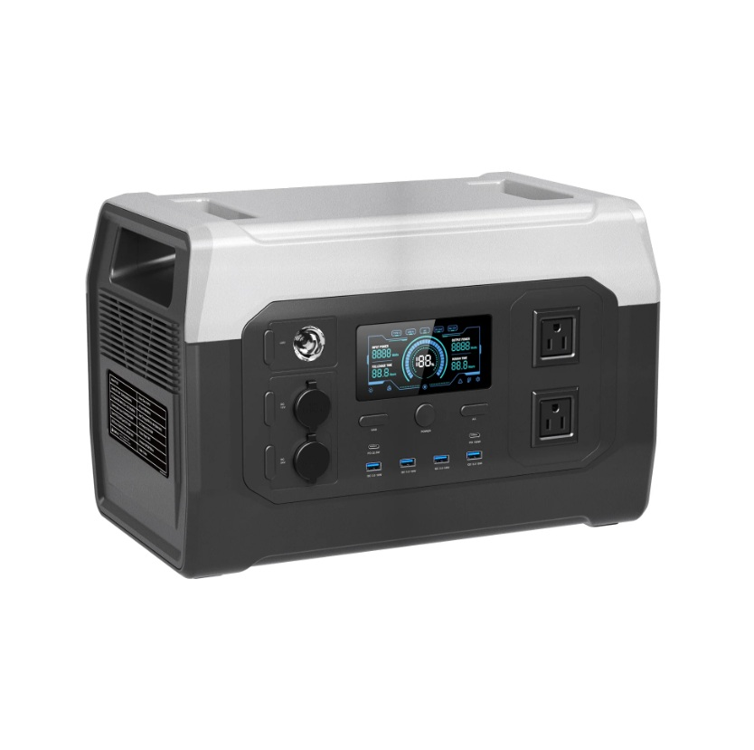

# CTOLITY XP1000: una estación de energía ideal para una vida Off-Grid

Cuando se vive en una cabaña rodeada de bosque, la electricidad deja de ser algo garantizado y se convierte en un recurso que debe administrarse cuidadosamente. Durante mis pruebas en el bosque utilicé la **CTOLITY XP1000**, una estación de energía portátil con batería de **1024 Wh** y un inversor de **1800 W**, diseñada para alimentar desde equipos electrónicos hasta pequeños electrodomésticos sin depender de la red eléctrica.

Su capacidad permite mantener funcionando computadoras portátiles, herramientas eléctricas, iluminación LED, cámaras, drones, routers de internet satelital, televisores e incluso algunos electrodomésticos de mayor consumo durante periodos razonables. Gracias a su salida de onda senoidal pura, los equipos electrónicos funcionan de forma estable y segura.

En un entorno autosustentable resulta especialmente útil como respaldo para días lluviosos, cuando la producción de los paneles solares disminuye. También es una excelente opción para llevar energía a lugares donde todavía no existe una instalación eléctrica permanente, evitando el uso de generadores de gasolina y el ruido que estos producen.

## Uso recomendado...

- Alimentar una computadora portátil durante varias jornadas de trabajo.
- Cargar baterías de cámaras, drones y herramientas inalámbricas.
- Mantener funcionando un router Starlink o equipos de comunicación.
- Iluminación de una cabaña durante la noche.
- Energía de respaldo para cortes eléctricos.
- Campamentos, expediciones y proyectos de construcción en zonas remotas.

Durante mis pruebas respondió correctamente a distintas cargas y demostró ser una solución muy práctica cuando se necesita energía portátil sin depender de combustibles.

## Mi experiencia en el bosque

Probé la CTOLITY XP1000 en condiciones reales dentro de mi proyecto de vida autosustentable. En el siguiente video puedes ver cómo la utilicé, y mis impresiones después de haberla usado.

<iframe src="https://www.youtube.com/embed/WWS-_pSLJYc"
title="Probando la CTOLITY XP1000 en mi choza"
style="position:absolute;top:0;left:0;width:100%;height:100%;border:0;"
allowfullscreen></iframe>

## Dónde comprar

Si te interesa conocer todas sus especificaciones técnicas o adquirir una, puedes hacerlo directamente desde la página oficial:

https://ctolitypower.com/products/ctolity-xp1000-1024wh-portable-power-station?srsltid=AfmBOorF7S-WwnqJDuC9O-z5Ou1nJ8fYrISMt6Egu1-vOFMD9bxFBvFH
