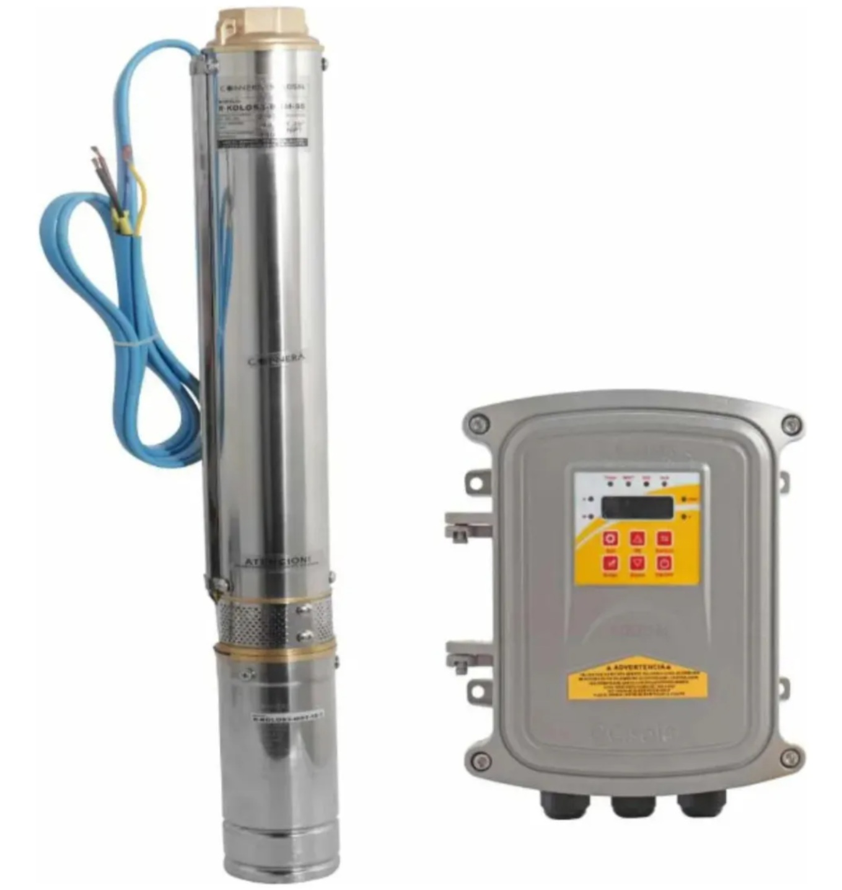
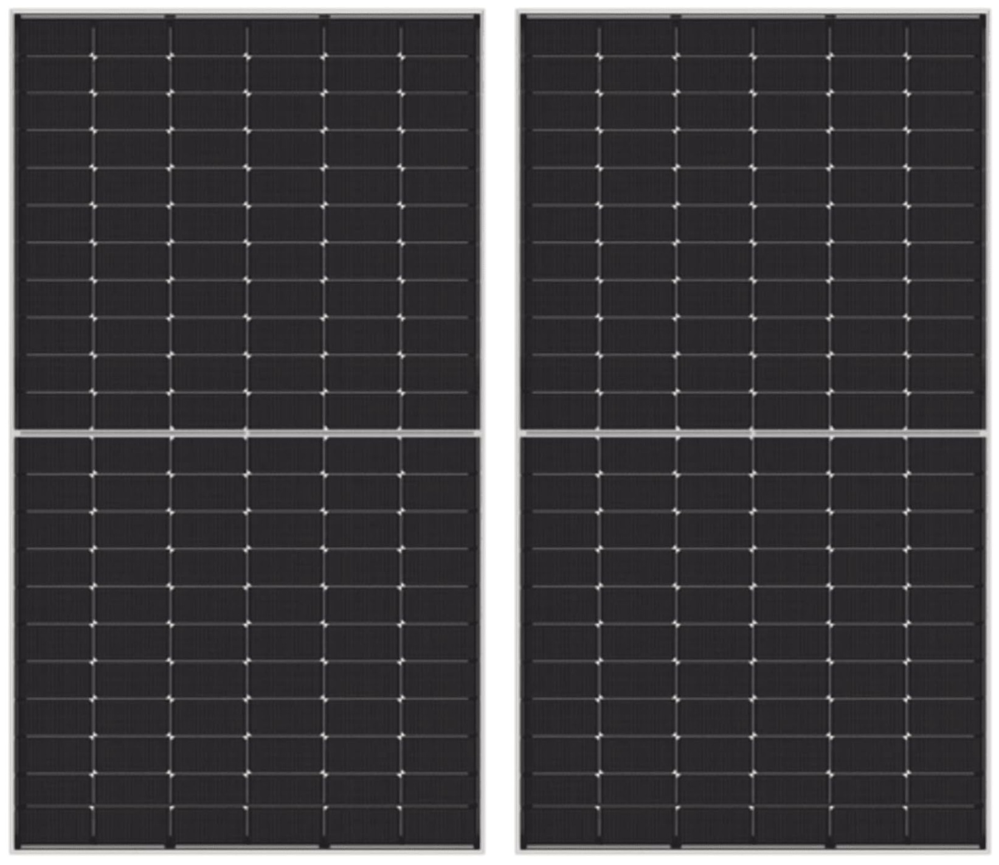
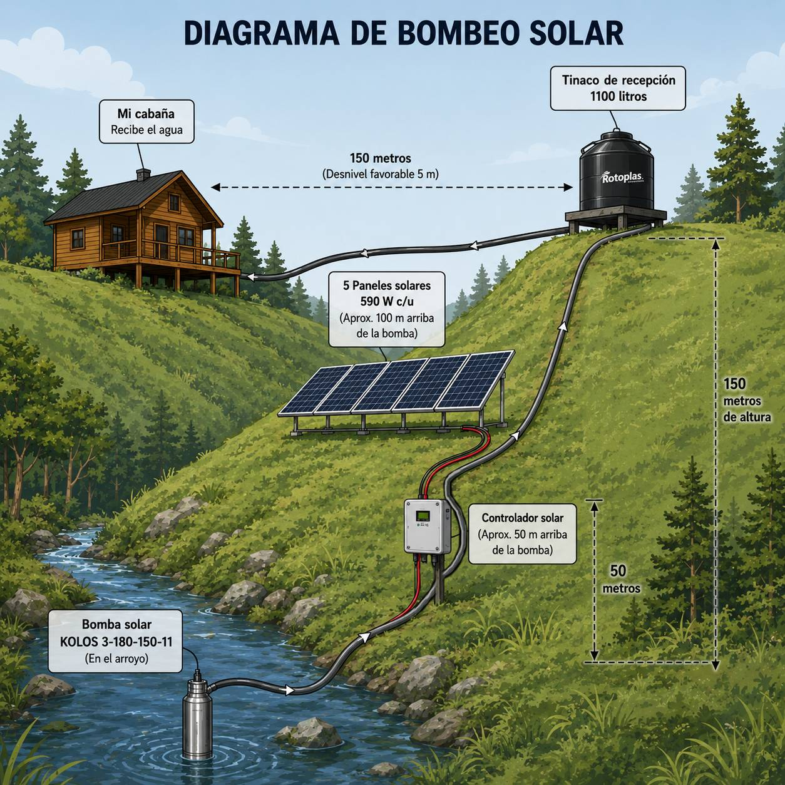

# Cómo Llevar Agua 150 Metros Cuesta Arriba Utilizando Únicamente Energía Solar

En una vivienda convencional basta con abrir una llave para tener agua. En una cabaña aislada eso no existe. Toda el agua de mi propiedad se encuentra aproximadamente **150 metros por debajo**, en un arroyo permanente, por lo que fue necesario diseñar un sistema capaz de bombearla hasta la cima de la montaña utilizando únicamente energía solar.

## El corazón del sistema

Después de analizar distintas alternativas elegí una **bomba solar Kolos** equipada con un controlador MPPT. Este controlador regula automáticamente la velocidad del motor según la energía disponible en los paneles solares, permitiendo que la bomba funcione incluso cuando el cielo está parcialmente nublado.

Además, incorpora arranque suave para reducir el golpe de ariete, protección contra trabajo en seco y la posibilidad de utilizar una fuente de respaldo en caso de emergencia.

## Energía completamente solar

El sistema se alimenta mediante **cinco paneles solares monocristalinos de 590 W**, conectados en serie para aprovechar mejor la energía y reducir las pérdidas eléctricas a lo largo del cableado.

Gracias a este arreglo, la bomba trabaja automáticamente durante las horas de mayor radiación solar sin necesidad de baterías ni combustible.

## Resultado

El agua recorre aproximadamente **300 metros de tubería** hasta llegar a un tinaco ubicado en la parte alta del terreno. Desde allí, la gravedad hace el resto, abasteciendo la cocina, el baño y el sistema de riego de la cabaña sin utilizar bombas adicionales.

Este proyecto demuestra que, con una buena planeación, es posible construir un sistema de abastecimiento de agua completamente autosustentable, capaz de operar todos los días únicamente con la energía del sol.

