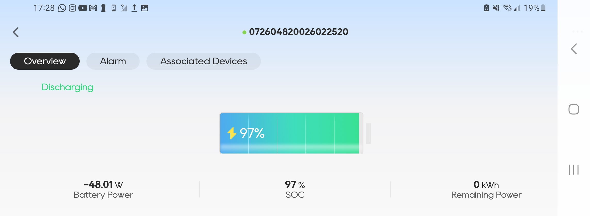
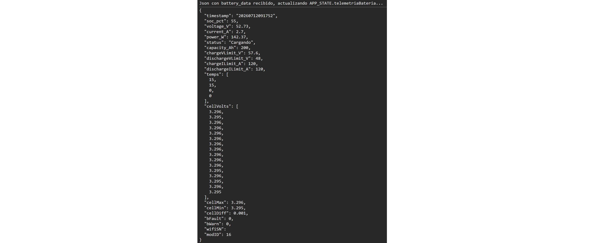
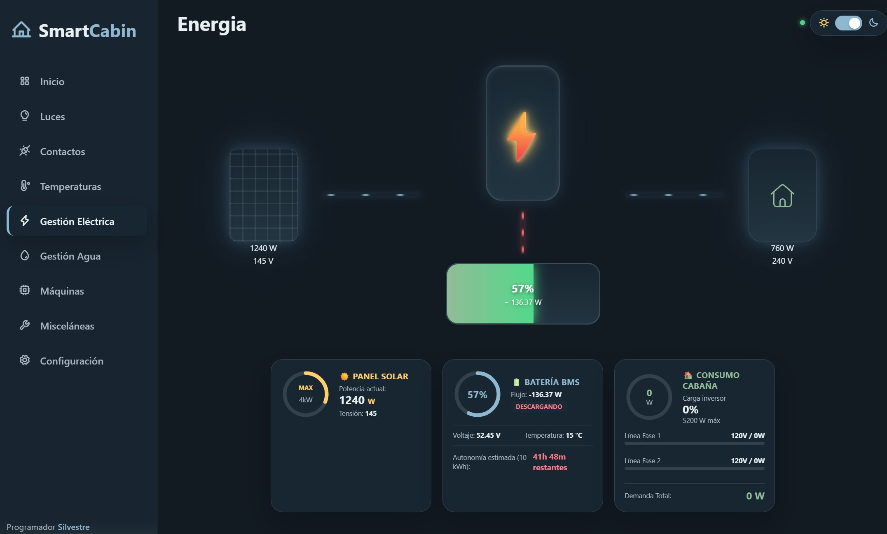

La llegada de la batería **Felicity Solar de 10 kWh** marcó un antes y un después dentro de la infraestructura energética de la cabaña. Además de almacenar toda la energía producida por los paneles solares, incorporaba una aplicación oficial para teléfonos móviles desde la cual era posible consultar en tiempo real prácticamente todos los parámetros del sistema: porcentaje de carga, potencia de entrada y salida, voltajes, corrientes y el estado general del banco de baterías.

Durante los primeros días utilicé esa aplicación constantemente. Era fascinante observar cómo la batería respondía a los cambios de consumo o cómo aumentaba su nivel de carga conforme avanzaba la mañana y los paneles comenzaban a producir más energía. Sin embargo, muy pronto apareció un problema que probablemente cualquier persona dedicada a la automatización terminaría encontrando.

No quería depender de una aplicación externa para consultar información que pertenecía a mi propia infraestructura.

Mi cabaña ya contaba con un dashboard desarrollado completamente por mí, desde donde podía supervisar sensores, controlar dispositivos y visualizar distintos elementos del ecosistema de domótica. Tener que sacar el teléfono únicamente para conocer el estado de la batería rompía por completo esa integración.

El objetivo se volvió muy claro: descubrir cómo obtenía la aplicación oficial esa información e incorporarla directamente dentro de mi propio sistema.

La primera pista apareció al conectar la batería a la red Wi-Fi de la cabaña. Una vez enlazada a la red local, la aplicación dejó de comunicarse mediante Bluetooth y comenzó a intercambiar información utilizando la infraestructura de red existente. Eso significaba que toda la comunicación estaba viajando por mi propia red, y por lo tanto podía ser observada.

Para analizar ese tráfico utilicé una herramienta llamada **PCAPdroid**, capaz de capturar todas las conexiones realizadas por una aplicación Android. La idea era muy sencilla: si la aplicación mostraba la información de la batería, necesariamente debía solicitarla a través de algún protocolo de red.

Después de varios minutos observando las peticiones comenzó a aparecer un patrón muy claro. La aplicación realizaba solicitudes HTTP hacia la dirección IP asignada a la batería dentro de la red local. Entre todos los endpoints existía uno especialmente interesante llamado **get real infor**, el cual devolvía un documento JSON con prácticamente toda la información que aparecía en la interfaz oficial.

Aquel descubrimiento simplificó enormemente el proyecto.

No era necesario desarrollar ingeniería inversa sobre un protocolo propietario ni interceptar comunicaciones cifradas. Bastaba con realizar una petición HTTP GET exactamente igual a la que ejecutaba la aplicación oficial para obtener todos los datos necesarios.

Con el JSON en mis manos, el resto del trabajo consistió únicamente en interpretar correctamente cada uno de sus campos. Escribí una función encargada de procesar la respuesta y convertir esos valores en información fácilmente consumible por el dashboard de la cabaña.

Entre los datos integrados se encuentran:

- Estado de carga (SOC).
- Potencia de carga.
- Potencia de descarga.
- Flujo instantáneo de energía.
- Voltajes.
- Corrientes.
- Estado general de operación.

Toda esta información comenzó a actualizarse automáticamente dentro de la interfaz web que utilizo diariamente para supervisar la cabaña.

Lo más interesante de este proyecto es que la batería dejó de ser un elemento aislado dentro de la instalación y pasó a formar parte de mi propio ecosistema de monitoreo y domótica. Ahora toda su información puede visualizarse desde el mismo dashboard que controla el resto de la cabaña, permitiendo centralizar el estado del sistema energético en un solo lugar.

Sin embargo, este proyecto representa solo una parte del objetivo final. El siguiente paso será integrar también el inversor híbrido al mismo dashboard, para visualizar en tiempo real la energía que producen los paneles solares, el consumo de la cabaña, el estado de las baterías y el flujo completo de energía de la instalación.

Cuando esa integración esté terminada, el dashboard se convertirá en un monitor solar completamente desarrollado por mí, sin depender de aplicaciones de terceros y totalmente integrado con la domótica de la cabaña. Además de visualizar toda la información en un solo lugar, podré utilizar esos datos para crear automatizaciones inteligentes, generar históricos, analizar el rendimiento del sistema y tomar decisiones basadas en el comportamiento energético de la instalación.

Ese será el siguiente proyecto, así que si te interesa ver cómo se construye un sistema de monitoreo solar completamente personalizado, espéralo porque muy pronto lo compartiré.
