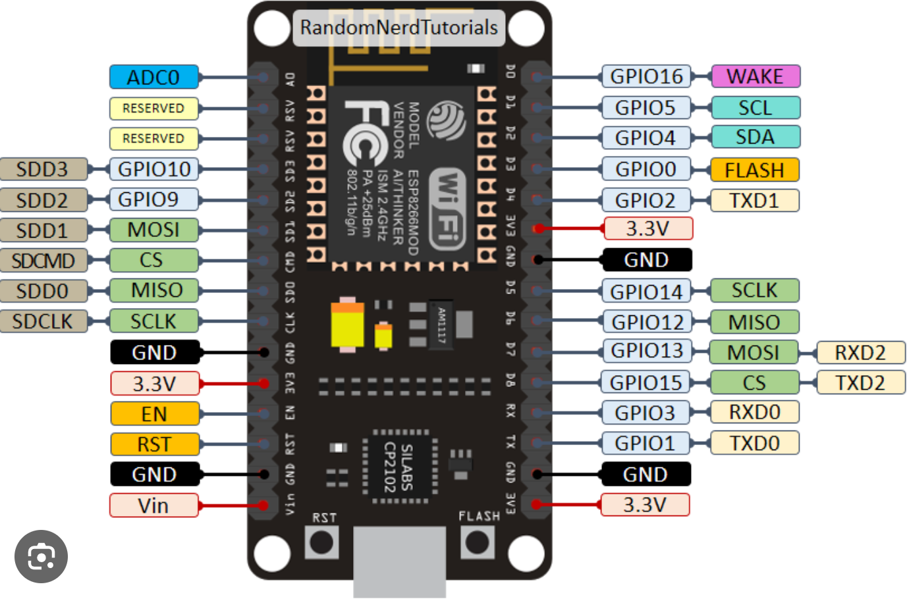

Vivir de manera autosustentable implica saber exactamente cuánta energía produces y cuánta consumes. Cansado de tener que salir a revisar los medidores analógicos bajo la lluvia para saber el estado de las baterías de la cabaña, decidí automatizar la lectura de mi sistema de paneles solares.

Desarrollé un pequeño script que lee las líneas de datos del controlador de carga y procesa los voltajes en tiempo real.

Los datos recopilados se transforman en una estructura ligera que se envía de forma periódica a mi base de datos. Gracias a esto, puedo predecir con precisión cuántas horas de autonomía me quedan si el día se pone nublado, permitiéndome administrar el uso de la computadora y las luces sin sorpresas desagradables a mitad de la noche.
