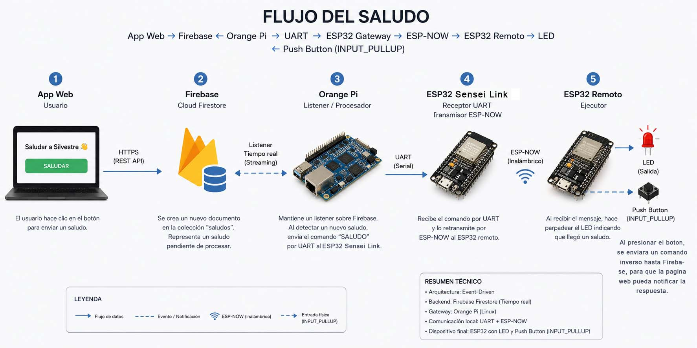

La idea surgió al pensar en una forma sencilla de que cualquier visitante de la página pudiera interactuar en tiempo real con mi cabaña. El objetivo era que un usuario pudiera enviarme un saludo con un solo clic y que ese evento terminara materializándose físicamente mediante el parpadeo de un LED ubicado en mi escritorio.

Para desacoplar la aplicación web de la infraestructura local decidí utilizar Firebase como intermediario. La aplicación web únicamente tiene la responsabilidad de registrar un nuevo documento en una colección cuando el usuario presiona el botón "Saludar a Silvestre". Cada registro representa un evento de saludo pendiente de procesar.

Al analizar ese diagrama, probablemente surja la pregunta Porque razon ha creado una infraestructura compleja para una tarea tan sencilla? La respuesta es simple, toda esa infraestructura ya 
estaba creada, es asi como la Orange Pi (cerebro de la cabaña) mantiene el control con los dispositivos que le rodean, con el Sensei Link, es su "antena", entonces para este proyecto
solo se agrego un nodo final (Esp32 actuador) a la infraestructura ya creada.

La Orange Pi mantiene un listener permanente sobre la colección de saludos en Firebase utilizando la API de tiempo real de Firestore. Cuando detecta la creación de un nuevo documento, interpreta ese evento como un saludo pendiente y envía un comando a través de una interfaz UART hacia un ESP32 que actúa como gateway de la red local.

Este ESP32 recibe el comando serial y lo retransmite mediante ESP-NOW hacia un segundo ESP32 remoto. Elegí ESP-NOW porque necesitaba una comunicación inalámbrica de baja latencia, sin depender de la infraestructura Wi-Fi para los dispositivos finales y con un protocolo ligero para el intercambio de mensajes.

Al recibir el paquete, el ESP32 remoto ejecuta una secuencia de parpadeo sobre un LED, indicando que alguien ha enviado un saludo desde la página web. En otras palabras, un simple clic realizado desde Internet termina convirtiéndose en una acción física dentro de mi espacio de trabajo.

Además del LED, este mismo ESP32 incorpora un pulsador configurado como INPUT_PULLUP. Dicho botón representa la respuesta física al saludo recibido. Como el dispositivo se encuentra en mi escritorio, únicamente puedo responder cuando realmente estoy presente, normalmente durante mis horas de programación.

Este detalle fue completamente intencional. No quería una respuesta automática generada por software; la idea era conservar el componente humano de la interacción. Si el usuario recibe una respuesta, significa que realmente estaba sentado en mi escritorio en ese momento y presioné el botón para contestar el saludo.

Aunque el proyecto es técnicamente sencillo, me pareció un experimento interesante para conectar una aplicación web con hardware físico utilizando una arquitectura orientada a eventos. El recorrido completo de un saludo atraviesa múltiples capas del sistema: una aplicación web, un servicio en la nube, un equipo Linux embebido, comunicación UART, una red inalámbrica basada en ESP-NOW y, finalmente, un microcontrolador encargado de interactuar con el mundo físico mediante un LED y un pulsador.
