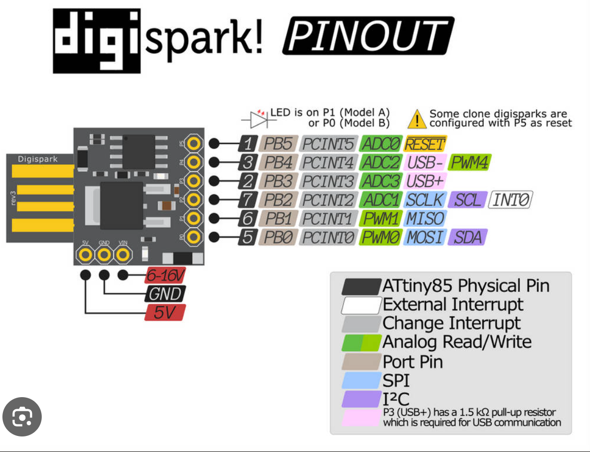

Pensando en la idea de cómo puede un usuario interactuar con mi cabaña y conmigo, se me ocurrió que en la página pudiera haber un botón de saludar a silvestre y al picarle se envíe el saludo hasta mi cabaña y visualizarlo con el parpadeo de un led. Para materializar este proyecto primeramente utilicé firebase como intermediario.

La lógica de la página es simple: cada que alguien clickea el botón se envía un registro a firebase con un campo diciendo 'enviado'. 

Entonces la opi está al tanto de firebase y cuando detecte que ha habido un registro nuevo de saludo, envía la orden de 'saludo' al esp32 final, este a su vez hace parpadear un led. También este esp32 tiene un botón físico el cual yo personalmente presionaré para responder el mensaje, entonces ese botón físico está en mi escritorio por ende solo podré responder en mis horas de 'programando'.

Y esta idea de un saludo rápido fue algo que pensé un día y decidi ejecutarla. Y bueno hasta aquí la explicación gracias.
